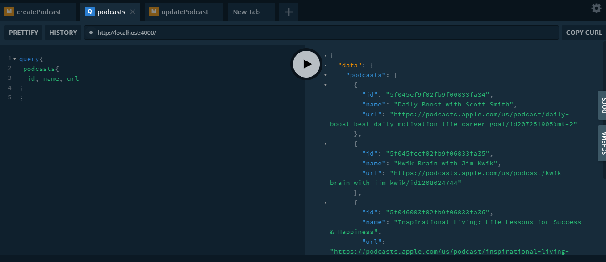

## Click to see the live api:  [Podcast-Graphql-API](https://marvel-graphql-podcast.herokuapp.com/)

# Podcast-Graphql-API

## About
A simple Graphql API that allows you to query and mutate Podcast details.
Built using  Node.js and the  Apollo-Server library, deployed it on Heroku.

## Tech Stack
ExpressJS --- MongoDB Atlas --- Mongoose --- Apollo-Server

### Schema 
    schema {
    query: Query
    mutation: Mutation
    }
    
    type Podcast {
    id: ID!
    name: String!
    url: String!
    }

    input CreatePodcastInput {
    name: String!
    url: String!
      }

    input UpdatePodcastInput {
    name: String
    url: String
    }

    input DeletePodcastInput {
    id: ID!
    }

    type DeletePayload{
    id: ID!
    }

    type Query {
    podcasts: [Podcast]
      }

    type Mutation {
    createPodcast(input: CreatePodcastInput!): Podcast!
    updatePodcast(id: ID!, input: UpdatePodcastInput!): Podcast!
    deletePodcast(id: ID!): DeletePayload!
    }
    
## Sample Query and Mutations

####  query

#### create

####  update

## App Info

### Author
Ibironke Marvellous
